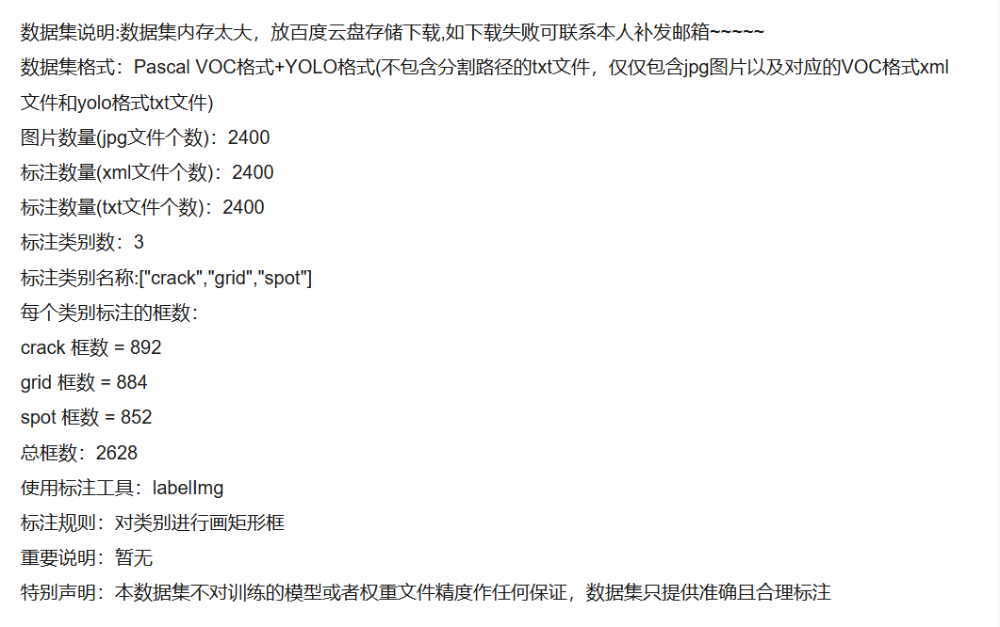
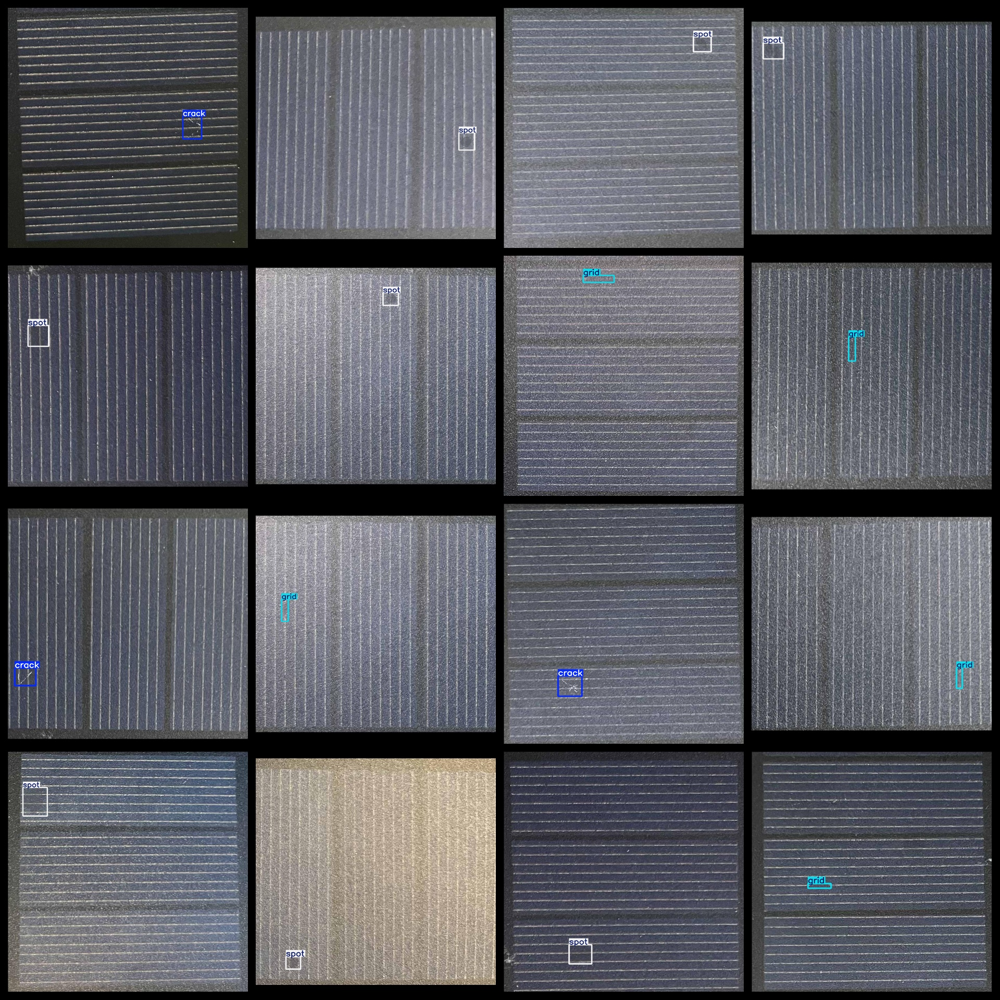

# [Object Detection] Photovoltaic PLATE Sun Energy Edition Defect Detection Dataset VOC+YOLO format2400 images3-class

Dataset Description: ~

Dataset format: Pascal VOC format + YOLO format (the txt file does not contain the split path, it only contains jpg images and corresponding VOC format xml files and yolo format txt files)

Number of image files (jpg): 2400

Number of xml files: 2400

Number of txt files: 2400

Number of annotated categories: 3

Annotation class names: ["crack","grid","spot"]

Number of boxes labeled in each category:

crack frame count = 892

grid frame count = 884

spot frame count = 852

Total boxes: 2628

Use the labeling tool: labelImg

Rules for annotation: Draw a rectangle around the category.

Important Note: None

Special Notice: This dataset does not guarantee the accuracy or precision of the trained models or weight files. The dataset only provides accurate and reasonable annotations.

## Images

---

Here is a pay link on Stripe (https://buy.stripe.com/3cs8yP7sY87d0vu9AB). Please contact me lonlonago@foxmail.com after funding $89, and I will send you a complete data files, thank you!

